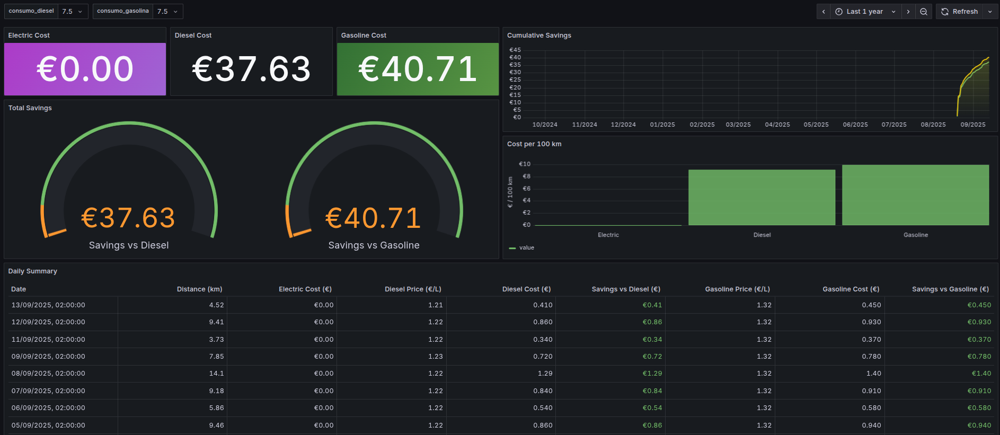

# EV Savings vs Fuel Dashboard for TeslaMate

A comprehensive solution that integrates with TeslaMate to track fuel prices and compare electric vehicle savings against traditional fuel costs. This project includes a Flask web application for fuel price management and custom Grafana dashboards for visualization.

## Features

- 🚗 **TeslaMate Integration**: Seamlessly connects to your existing TeslaMate database
- ⛽ **Fuel Price Tracking**: Web interface to input and manage diesel and gasoline prices
- 📊 **Custom Grafana Dashboards**: Visual comparison of EV savings vs fuel costs
- 🐳 **Docker Support**: Easy deployment with Docker and Docker Compose
- 📱 **Responsive Design**: Mobile-friendly web interface for price management

## Screenshots

### Fuel Price Management App


### Grafana Dashboard


## Prerequisites

- Docker and Docker Compose installed
- Running TeslaMate instance with PostgreSQL database
- Access to TeslaMate's PostgreSQL database

## Quick Start

### 1. Clone the Repository

```bash
git clone https://github.com/ALArvi019/ev-savings-vs-fuel-dashboard-teslamate.git
cd ev-savings-vs-fuel-dashboard-teslamate
```

### 2. Database Setup

First, you need to create the fuel prices table in your TeslaMate database:

```bash
# Connect to your TeslaMate PostgreSQL database and run:
psql -h your-database-host -U teslamate -d teslamate -f init-fuel-prices-table.sql
```

### 3. Configuration

Create your environment configuration:

```bash
cp .env.example .env
```

Edit the `.env` file with your actual database credentials:

```env
DATABASE_PASS=your-actual-database-password
DATABASE_USER=your-actual-database-user
DATABASE_NAME=your-actual-database-name
DATABASE_HOST=database
FLASK_SECRET_KEY=your-secure-secret-key
```

### 4. Integration with TeslaMate

You have two options for deployment:

#### Option A: Add to Existing TeslaMate Docker Compose

Add this service to your existing TeslaMate `docker-compose.yml`:

```yaml
fuel-app:
  build: 
    context: ./path/to/ev-savings-vs-fuel-dashboard-teslamate
  restart: always
  ports:
    - "5000:5000"
  environment:
    DATABASE_USER: teslamate
    DATABASE_PASS: ${DATABASE_PASS}
    DATABASE_NAME: teslamate
    DATABASE_HOST: database
    FLASK_SECRET_KEY: ${FLASK_SECRET_KEY}
  depends_on:
    database:
      condition: service_healthy
  networks:
    - your-teslamate-network
```

#### Option B: Standalone Deployment

Update the `docker-compose.yml` file in this repository to match your TeslaMate network configuration, then run:

```bash
docker-compose up -d
```

### 5. Grafana Dashboard Setup

To add the custom dashboards to your TeslaMate Grafana instance:

1. **Update your TeslaMate Grafana service** in docker-compose.yml:

```yaml
grafana:
  image: teslamate/grafana:latest
  restart: always
  environment:
    - DATABASE_USER=teslamate
    - DATABASE_PASS=${DATABASE_PASS}
    - DATABASE_NAME=teslamate
    - DATABASE_HOST=database
    - GF_SECURITY_ADMIN_USER=admin
    - GF_SECURITY_ADMIN_PASSWORD=${GRAFANA_PASSWORD}
    - GF_USERS_ALLOW_SIGN_UP=false
    - GF_AUTH_ANONYMOUS_ENABLED=true
    - GF_AUTH_ANONYMOUS_ORG_ROLE=Viewer
    - TZ=Europe/Madrid
  depends_on:
    - database
  ports:
    - "3000:3000"
  volumes:
    - grafana-storage:/var/lib/grafana
    - ./path/to/ev-savings-vs-fuel-dashboard-teslamate/grafana/customdashboards.yml:/etc/grafana/provisioning/dashboards/customdashboards.yml
    - ./path/to/ev-savings-vs-fuel-dashboard-teslamate/grafana/dashboards:/etc/grafana/provisioning/dashboards/dashboards-json
  networks:
    - your-teslamate-network
```

2. **Restart your Grafana container**:

```bash
docker-compose restart grafana
```

## Usage

### Adding Fuel Prices

1. Navigate to `http://your-server:5000`
2. Use the web interface to add daily fuel prices for diesel and gasoline
3. Prices are stored in your TeslaMate database for analysis

### Viewing Dashboards

1. Access your Grafana instance at `http://your-server:3000`
2. Navigate to the custom dashboards section
3. View the EV savings comparison dashboards

## Development

### Local Development Setup

```bash
# Create a virtual environment
python -m venv venv
source venv/bin/activate  # On Windows: venv\Scripts\activate

# Install dependencies
pip install -r requirements.txt

# Set environment variables
export DATABASE_HOST=localhost
export DATABASE_USER=teslamate
export DATABASE_PASS=your-password
export DATABASE_NAME=teslamate

# Run the application
python app.py
```

### Testing Database Connection

Use the included test script to verify database connectivity:

```bash
python test_db.py
```

## File Structure

```
ev-savings-vs-fuel-dashboard-teslamate/
├── app.py                          # Main Flask application
├── requirements.txt                # Python dependencies
├── Dockerfile                      # Docker configuration
├── docker-compose.yml              # Docker Compose configuration
├── .env.example                    # Environment variables template
├── init-fuel-prices-table.sql      # Database initialization script
├── test_db.py                      # Database connection test
├── templates/
│   └── index.html                  # Web interface template
├── grafana/
│   ├── customdashboards.yml        # Grafana dashboard provisioning
│   └── dashboards/                 # Custom dashboard JSON files
└── screenshots/
    ├── fuel-app.png               # Application screenshot
    └── grafana-dashboard.png      # Dashboard screenshot
```

## Contributing

1. Fork the repository
2. Create a feature branch
3. Make your changes
4. Add tests if applicable
5. Submit a pull request

## Support

If you encounter any issues or have questions:

1. Check the [Issues](https://github.com/ALArvi019/ev-savings-vs-fuel-dashboard-teslamate/issues) page
2. Create a new issue with detailed information about your problem
3. Include your system configuration and error messages

## Acknowledgments

- [TeslaMate](https://github.com/adriankumpf/teslamate) - The fantastic Tesla data logger this project integrates with
- [Grafana](https://grafana.com/) - For the excellent visualization platform
- [Flask](https://flask.palletsprojects.com/) - The web framework powering the fuel price app
EV savings vs fuel cost dashboard and app for TeslaMate integration with custom Grafana dashboards
